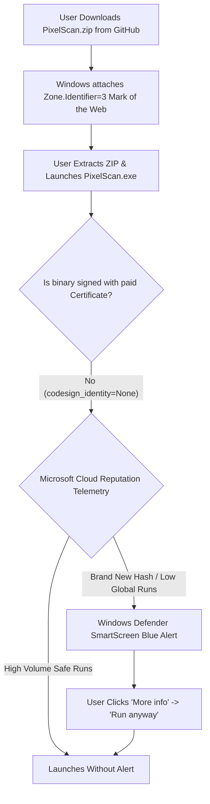

# ⚡ PixelScan: Complete Technical Documentation, Build Pipeline & Windows SmartScreen Analysis

> **Project:** PixelScan (`image_compreser`)  
> **Workspace Root:** `F:\IJSE\THIRED SEM\PYTHON\image_compreser`  
> **Author:** Hasitha Wijesinghe ([@HasithaLWi](https://github.com/HasithaLWi))  
> **Version:** `v0.1.2.0`  
> **License:** MIT License  
> **Target OS:** Windows 10 & 11 (64-bit)  

---

## 1. Project Overview & Architecture

**PixelScan** is a high-performance desktop image compression, reconstruction, and verification suite. It operates directly at the individual pixel level, offering two core workflows:

1. **Proprietary Binary & String Compression (`.icomp`):**
   Scans images row-by-row and column-by-column, encoding RGB values into custom binary packages and human-readable text representations.
2. **Direct File Optimization:**
   Strips hidden camera EXIF bloat, device thumbnails, and unoptimized metadata tables, compressing photos to WebP, JPEG, or PNG with up to **70%–90% file size reduction** and 100% lossless or near-lossless fidelity.

```
                      PIXELSCAN SYSTEM ARCHITECTURE
                      
               +----------------------------------------+
               |        Desktop GUI (CustomTkinter)     |
               |  - src/my_app/gui/app.py               |
               |  - Tab 1: Compress Image               |
               |  - Tab 2: Decompress Image             |
               |  - Tab 3: Lossless Pixel Verifier      |
               |  - Tab 4: Direct File Formatter        |
               +----------------------------------------+
                                   ▲
                                   │ (Background Worker Threads)
                                   ▼
               +----------------------------------------+
               |       Core Engine & Pixel Coders       |
               |  - src/my_app/core/pixel_coder.py      |
               |  - 8 Compression Engines               |
               |  - Pillow (PIL) + NumPy Operations     |
               |  - ImageChops C-Difference Verification|
               +----------------------------------------+
                                   ▲
                                   │ (Config & Routing)
                                   ▼
               +----------------------------------------+
               |        Configuration & Constants       |
               |  - src/my_app/config.py                |
               |  - src/my_app/main.py (CLI / GUI)      |
               +----------------------------------------+
```

---

## 2. Technology Stack

| Layer | Technology | Key Responsibility |
| :--- | :--- | :--- |
| **GUI Framework** | **CustomTkinter** (`customtkinter`) | Modern dark/light mode desktop interface, tabbed navigation, responsive layouts, non-freezing worker threads. |
| **Image Processing** | **Pillow** (`PIL`) | Image ingestion, EXIF stripping, palette quantization, color table generation, WebP/JPEG/PNG saving. |
| **Pixel Arrays & Math** | **NumPy** (`numpy`) | High-speed multi-dimensional array operations for scanning raw RGB matrices. |
| **Lossless Verification**| **`PIL.ImageChops`** | C-accelerated pixel-by-pixel mathematical difference testing (<100 ms for millions of pixels). |
| **Standard Packaging** | **PyInstaller** (`pyinstaller`) | Standalone `--onedir` Windows executable packager. |
| **C-Machine Compilation**| **Nuitka** (`nuitka` + MSVC) | Translates Python code directly to C machine code for native performance and source code protection. |

---

## 3. How the Build Pipelines Work

PixelScan features **two independent build pipelines**, both located directly in the project root:

### 3.1 Pipeline A: PyInstaller Standalone Build (`build_pyinstaller.bat`)

The primary build script is [`build_pyinstaller.bat`](file:///f:/IJSE/THIRED%20SEM/PYTHON/image_compreser/build_pyinstaller.bat):

```cmd
call ".venv\Scripts\pyinstaller.exe" ^
  --name "PixelScan" ^
  --windowed ^
  --onedir ^
  --noconfirm ^
  --clean ^
  --add-data ".venv\Lib\site-packages\customtkinter;customtkinter\" ^
  --paths "." ^
  src\my_app\main.py

copy /Y "README.txt" "dist\PixelScan\" >nul
copy /Y "HOW_TO_USE.txt" "dist\PixelScan\" >nul
copy /Y "LICENSE" "dist\PixelScan\" >nul
```

#### Key Flags Explained:
- `--onedir`: Generates a folder containing `PixelScan.exe` and its supporting DLLs, rather than packing everything into a single compressed binary.
- `--windowed`: Suppresses the command prompt console window so only the clean GUI appears.
- `--add-data "...customtkinter;customtkinter\"`: Bundles CustomTkinter’s JSON themes and SVG/PNG icon assets into the final directory.
- `copy /Y "HOW_TO_USE.txt" ...`: Automatically bundles user documentation alongside the `.exe`.

---

### 3.2 Pipeline B: Nuitka C-Machine Code Compilation (`build_nuitka.bat`)

The second build script is [`build_nuitka.bat`](file:///f:/IJSE/THIRED%20SEM/PYTHON/image_compreser/build_nuitka.bat):

```cmd
call ".venv\Scripts\python.exe" -m nuitka ^
  --standalone ^
  --windows-console-mode=disable ^
  --enable-plugin=tk-inter ^
  --include-package-data=customtkinter ^
  --output-dir=dist\PixelScan_Nuitka ^
  --assume-yes-for-downloads ^
  src\my_app\main.py
```

#### Key Advantages:
- Translates Python syntax to pure C and compiles with Microsoft Visual C++ (MSVC).
- Eliminates Python bytecode interpretation overhead for intense pixel loops.
- Provides tamper-resistance for the binary and proprietary algorithms.

---

## 4. How It Affects Windows Defender SmartScreen & Antivirus

### 4.1 The Root Cause of SmartScreen on PixelScan

When end-users download PixelScan from GitHub or the web, Windows evaluates the binary through three filters:



1. **Mark of the Web (`Zone.Identifier`):** Windows attaches an NTFS Alternate Data Stream `Zone.Identifier=3` to files downloaded from external URLs.
2. **Unsigned Executable:** In [`PixelScan_PyInstaller.spec`](file:///f:/IJSE/THIRED%20SEM/PYTHON/image_compreser/PixelScan_PyInstaller.spec), notice:
   ```python
   codesign_identity=None  # No $200-$400/yr certificate
   ```
3. **Reputation Engine:** Microsoft Defender SmartScreen relies on cloud telemetry. Any newly generated hash with low download numbers is flagged as "unrecognized" by default.

---

### 4.2 Why `--onedir` Was Chosen Over `--onefile` (Heuristic Protection)

PyInstaller’s `--onefile` mode compresses the entire application into a single `.exe`. Upon launch, that executable silently unpacks Python DLLs into:
```
C:\Users\<User>\AppData\Local\Temp\_MEIxxxxxx\
```
**The Problem:**
- Malware commonly uses this exact runtime unpacking technique to avoid static disk scans.
- Windows Defender heuristic engines routinely flag temporary PyInstaller unpacked binaries as generic threats (such as `Trojan:Win32/Wacatac` or `Win32/UnwantedSig`).

**How PixelScan Avoids This:**
- By choosing `--onedir` in `build_pyinstaller.bat` and `--standalone` in `build_nuitka.bat`, all binaries, DLLs, and assets remain stationary in `dist\PixelScan\`.
- Because nothing extracts dynamically into `%TEMP%`, heuristic antivirus false-positive alerts are drastically minimized, and the app launches up to 10x faster.

---

### 4.3 How PixelScan Handles SmartScreen for End Users

PixelScan solves the SmartScreen barrier cleanly without paying for commercial certificates using a **3-point open-source distribution strategy**:

1. **Self-Documenting Portable Package:**
   The build script bundles [`HOW_TO_USE.txt`](file:///f:/IJSE/THIRED%20SEM/PYTHON/image_compreser/HOW_TO_USE.txt) and [`README.txt`](file:///f:/IJSE/THIRED%20SEM/PYTHON/image_compreser/README.txt) directly into the root of `dist\PixelScan\`.
2. **Direct SmartScreen FAQ Guidance:**
   In [`HOW_TO_USE.txt`](file:///f:/IJSE/THIRED%20SEM/PYTHON/image_compreser/HOW_TO_USE.txt) (Section 6, Q1):
   > **Q1: Windows SmartScreen shows "Windows protected your PC" when I first launch.**  
   > **A:** This happens for any new, unsigned executable downloaded from the internet. Click **"More info"** and then click **"Run anyway"**. Windows will remember your decision and will not ask again.
3. **Clear Open-Source Transparency:**
   The project includes full author credentials, MIT license attribution, and link to public source code ([GitHub @HasithaLWi](https://github.com/HasithaLWi)), allowing users and IT administrators to independently verify that the binary is completely safe.
